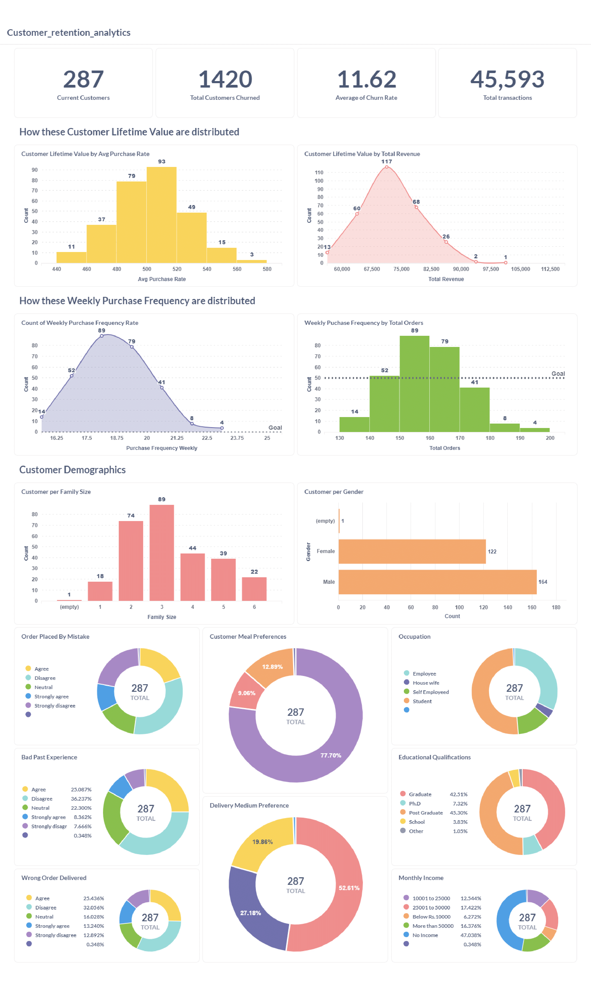

[](https://hits.seeyoufarm.com)
# customer_retention_analytics

# Problem Statements:

- **High customer churn:** We are experiencing a high rate of customer churn, leading to lost revenue and a shrinking customer base.
- **Limited understanding of customer behavior:** We lack a deep understanding of why customers churn and what factors influence their purchasing decisions.
- **Ineffective customer engagement:** Our current strategy might not be effectively engaging customers and encouraging repeat purchases.

# Project Overview:

This project aims to improve customer retention by analyzing customer data and identifying key drivers of churn.

## Objectives:

- Analyze customer behavior and identify factors contributing to churn.
- Develop metrics to track and measure customer retention.
- Create a customer segmentation model to identify high-risk churn segments.
- Design and implement targeted retention strategies for different customer segments.
- Monitor and evaluate the effectiveness of retention efforts.

## Deliverables:

- Customer retention dashboard with key metrics (churn rate, CLV, repeat purchase rate).
- Monthly/quarterly customer retention reports with insights and trends.
- Customer segmentation model for churn risk identification.
- Recommendations for targeted retention programs.

## Expected Benefits:

- Reduce customer churn and increase customer lifetime value.
- Improve customer engagement and loyalty.
- Gain a deeper understanding of customer needs and preferences.
- Optimize marketing campaigns for better customer acquisition and retention.

# Project Architecture Overview


The project architecture revolves around seamless data flow, orchestrated by Docker containers and various data processing pipelines. Events originating from food delivery app transactions,CSV files and customer data from Postgres database are captured in a streaming Docker container, forwarded to a Kafka topic named "customer_activity_data," and processed through a series of pipelines for transformation and analysis.

## Data Flow

- **Data Ingestion**: Events from food delivery app transactions and CSV files are produced in a streaming Docker container and sent to the Kafka topic "customer_activity_data."
  
- **Batch Processing**: Kafka Streaming pipeline, orchestrated by Mage, consumes data in batches of 1000. The data is then sent to a GCS bucket as "raw_streaming" as bronze-level data.

- **Transformation**: Raw streaming data from the GCS bucket and customer data from Postgres database undergoes transformation by Apache Spark, resulting in OLAP database design star schema format, and stored back into the GCS bucket as "transformed" silver-level data.

- **Export to BigQuery**: A Mage pipeline exports transformed data from the GCS bucket to BigQuery, facilitating easy accessibility and analysis.

- **DBT Transformation**: Transformed data in BigQuery is further transformed into "business transformed" gold-level data using DBT, ensuring enhanced analytics capabilities and insights extraction.

- **Terraform**: Infrastructure as a Service provided by Terraform. Used to create gcp resources like Google cloud buckets,bigquery datasets and compute service to run mage and the project.

## Other Features

- **Data Quality Assurance**: The architecture incorporates three different data levels—bronze, silver, and gold—ensuring high-quality data availability for analysts and data scientists, catering to diverse use cases.

- **Flexibility and Scalability**: Dockerized containers offer flexibility and scalability, enabling seamless integration and deployment of various components, ensuring adaptability to changing business needs.

- **Comprehensive Analytics**: The gold-level data stored in BigQuery serves as a robust foundation for downstream use cases, including dashboarding using Metabase, reporting, and machine learning for fraud detection, facilitating comprehensive analytics and informed decision-making.

## Additional Benefits

- **Modularity and Maintainability**: The modular design of the architecture promotes maintainability, allowing for easy updates and modifications to individual components without disrupting the entire system.

- **Cost-Efficiency**: By leveraging cloud-native services like GCS and BigQuery, the project optimizes costs associated with data storage and processing, ensuring efficient resource utilization.

- **Scalability and Performance**: The distributed nature of Apache Spark and Kafka Streaming enables scalability and performance enhancements, ensuring timely processing of large volumes of data without compromising performance.

Overall, the project architecture embodies best practices in data engineering, ensuring seamless data flow, high-quality data availability, and comprehensive analytics capabilities to drive business success.

## Tech Stack Used

The project leverages a comprehensive tech stack to facilitate efficient data processing and analytics. Key components include:

- **Docker**: Containerization platform providing isolation, portability, and scalability for project components.
- **Apache Kafka**: Distributed streaming platform for real-time data ingestion and processing.
- **Mage**: Orchestration tool for managing data pipelines and workflow execution.
- **Apache Spark**: Distributed computing framework for processing large-scale data with speed and efficiency.
- **DBT (Data Build Tool)**: Data transformation tool for converting raw data into actionable insights and facilitating analytics.
- **PostgreSQL**: Relational database management system for storing structured data.
- **Metabase**: Business intelligence tool for creating visualizations and dashboards to analyze data.
- **Google BigQuery**: Cloud-based data warehouse for storing and analyzing large datasets with high performance and scalability.
- **Google Cloud Storage (GCS)**: Object storage service for storing and accessing data in Google Cloud Platform.
- **Terraform**: Infrastructure as code tool for provisioning and managing cloud resources in a declarative manner.

This tech stack offers a robust foundation for building and deploying data processing pipelines, ensuring flexibility, scalability, and efficiency in handling diverse data analytics tasks. From data ingestion to transformation, storage, and analysis, each component plays a crucial role in enabling organizations to extract valuable insights and make data-driven decisions effectively.

## Pipeline Overview

### 1. Batch Pipeline

- **Folder**: [Batch Pipeline](./batch_pipeline/)
- **Spark Pipeline**: Processes raw data sourced from GCS, performs OLAP transformations, and stores transformed data back into GCS.
- **Mage Pipeline**: Exports transformed data from GCS to BigQuery.
- **Execution**: Detailed execution steps provided in the Batch Pipeline [README](./batch_pipeline/batch_pipeline.md).

### 2. Streaming Pipeline

- **Folder**: [Streaming Pipeline](./streaming_pipeline/)
- Dynamic component processing continuous data streams in real-time.
- Utilizes Kafka Streaming and Mage for efficient data ingestion, processing, and storage.
- **Execution**: Detailed execution steps provided in the Streaming Pipeline [README](./streaming_pipeline/streaming_pipeline.md).

### 3. DBT Pipeline

- **Folder**: [Dbt Pipeline](./business_transformation/)
- Transforms Silver level data in BigQuery into Gold level business transformations.
- Core models created from dim and fact tables facilitate insights extraction and decision-making.
- **Execution**: Detailed execution steps provided in the dbt Pipeline [README](./business_transformation/dbt_pipeline.md).

### 4. Dockerized Services

- **Folder**: [Docker Containers](./docker/)
- **Kafka**: Apache Kafka services including broker, REST proxy, Control Center, ZooKeeper, and Schema Registry.
- **Mage**: Services facilitating the execution of data pipelines.
- **PostgreSQL**: Database services for storing structured data.
- **Metabase**: Dashboarding tool services for creating and sharing data visualizations.
- **Spark**: Apache Spark services including master, workers, and Jupyter Notebook.
- **Streaming**: Services for producing messages for Kafka streaming.
- **Execution**: Detailed execution steps provided in the Docker [README](./docker/docker.md).

## Step-by-Step Execution Guide

I have created commands to run different parts of the project which makes running this project
very easy. For any queries or debugging help check the Debug [Readme](./debug.md).

Link the Tutorial Video: [Tutorial Video](https://www.loom.com/share/0165347d421c4b78bbe7e16482926017?sid=b36ad434-2f6f-4934-abe4-42110ef4c2e7)

Follow these steps to execute the project seamlessly but before that whenever you start a new terminal
run this command `source commands.sh` to create all the functions and environment variables.:

### 0. Initialising Terraform and creating Resources

Before this create a service account in GCP and get the credentials.json key.
Copy it in Docker/mage/ directory in place of google-cred.json
`Keeping the name google-cred.json is necessary`.

```bash
    terraform-start
```
This initialises terraform,gives you the overall plan and creates the resources.
if you want to destroy the reosurces use this command `terraform-destory`.

### 1. Start Streaming Pipeline

```bash
start-streaming-pipeline
```
This command initiates the streaming pipeline, which involves the following sub-steps:

- **Start Kafka**: Launches Kafka within a Docker container using the command `start-kafka`.
- **Start Mage**: Initiates Mage pipeline execution using the command `start-mage`.
- **Produce Stream Data**: Starts producing stream data by executing `start-stream`.

### 2. Start Batch Pipeline

```bash
start-batch-pipeline
```
This command kicks off the batch pipeline, consisting of the following sub-steps:

- **OLAP Transformation Pipeline**: Initiates Apache Spark and executes the OLAP transformation pipeline using the command `olap-transformation-pipeline`.
- **GCS-to-BigQuery Pipeline**: Triggers the Mage pipeline to export data to BigQuery using the command `gcs-to-bigquery-pipeline`.

### 3. DBT Transformation

Run the command `dbt run` to create the gold level transformations.

### 4. Dashboard Creation

Start Metabase using the following command:

```bash
start-metabase
```
With Metabase running, create insightful dashboards and reports using the transformed data stored in BigQuery.

#### Order Analytics Report 


#### Review Analytics Report 


#### Customer Retention Analytics Report 




Link to dashboard : http://opulent-space-goggles-569rq99x4p5c4rpq-3000.app.github.dev/public/dashboard/f64e91cd-4ea7-42d0-99a2-b2390463f813 (If it works)

### Automating all steps:

Use this command

```
start-project
```

This will run the entire project on its own.
Things you need to take care:
 - Updating the api endpoint for gcs-to-bigquery-pipeline(Shown in the tutorial video)
 - Executing the kafka_to_gcs pipeline from mage ui(Show in the project)

## Conclusion

Through real-time insights and proactive decision-making, our supply chain finance analysis platform redefines traditional methods. Leveraging Docker and cutting-edge technologies like Kafka and Spark, we optimize operations, enhance cash flow, and mitigate risks. This project showcases the transformative power of data-driven innovation for business growth and success.
