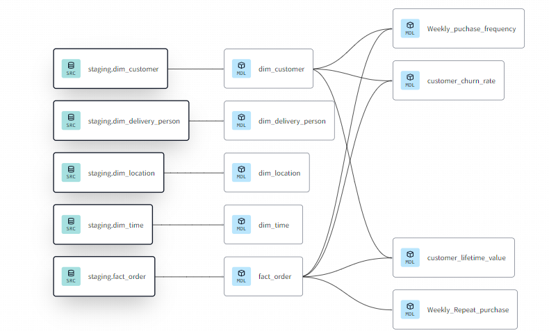

# DBT Business Transformation Models Overview

DBT (Data Build Tool) is a powerful data transformation tool used to convert Silver level transformed data in BigQuery into Gold level business transformations. Through the creation of Core models derived from dimensional (dim) and fact tables, DBT enables organizations to extract valuable insights and drive informed decision-making across various business domains.

## Executing in dbt-cloud cli

Using python method
- `pip3 install dbt --no-cache-dir` then
-  Download your cloud-configuration from the dbt-cloud Project page. For Demo purposes, I have provided my dbt_project.yaml file in the `business_transformations` folder
- Use these commands
 - `mkdir ~/.dbt`
 - `cp business_transformations/dbt_project.yaml ~/.dbt/` .
- Check using `dbt compile`
- Run the models using `dbt run command`
- To run specific model `dbt run --select {model_name}`


## Lineage Graph


Certainly! Here's a README.md file specifically for the new DBT models you provided:

---

# Customer Churn Rate

[Model](./models/core/customer_churn_rate.sql)

The Customer Churn Rate model calculates the churn rate, representing the percentage of customers who have stopped purchasing products or services from the organization over a specific period. It provides insights into customer retention and helps identify areas for improvement in customer satisfaction and loyalty.

### SQL Code:
```sql
SELECT 
          EXTRACT(YEAR FROM PARSE_DATE('%d-%m-%Y', o.Order_Date)) AS Year,
          EXTRACT(MONTH FROM PARSE_DATE('%d-%m-%Y', o.Order_Date)) AS Month,
          EXTRACT(DAY FROM PARSE_DATE('%d-%m-%Y', o.Order_Date)) AS Day,
          COUNT(DISTINCT c.customer_id) AS Total_Customers,
          COUNT(DISTINCT CASE WHEN lo.customer_id IS NULL THEN c.customer_id ELSE NULL END) AS Churned_Customers,
          ROUND((COUNT(DISTINCT CASE WHEN lo.customer_id IS NULL THEN c.customer_id ELSE NULL END) / COUNT(DISTINCT c.customer_id)) * 100, 2) AS Churn_Rate
      FROM `gothic-sylph-387906`.`customer_retention`.`fact_order` o
      LEFT JOIN (
          SELECT DISTINCT customer_id, 
                          EXTRACT(YEAR FROM PARSE_DATE('%d-%m-%Y', Order_Date)) AS Next_Order_Year,
                          EXTRACT(MONTH FROM PARSE_DATE('%d-%m-%Y', Order_Date)) AS Next_Order_Month,
                          EXTRACT(DAY FROM PARSE_DATE('%d-%m-%Y', Order_Date)) AS Next_Order_Day
          FROM `gothic-sylph-387906`.`customer_retention`.`fact_order`
      ) lo 
      ON lo.customer_id = o.customer_id 
          AND lo.Next_Order_Year = EXTRACT(YEAR FROM PARSE_DATE('%d-%m-%Y', o.Order_Date))
          AND lo.Next_Order_Month = EXTRACT(MONTH FROM PARSE_DATE('%d-%m-%Y', o.Order_Date))
          AND lo.Next_Order_Day = EXTRACT(DAY FROM PARSE_DATE('%d-%m-%Y', o.Order_Date)) + 1
      JOIN `gothic-sylph-387906`.`customer_retention`.`dim_customer` c ON c.customer_id = o.customer_id
      GROUP BY Year, Month, Day
      ORDER BY Year, Month, Day
```

---

# Customer Lifetime Value

[Model](./models/core/customer_lifetime_value.sql)

The Customer Lifetime Value model calculates the customer lifetime value (CLV), representing the total revenue generated by a customer over their entire relationship with the organization. It helps organizations understand the value of their customer base and allocate resources effectively to maximize profitability.

### SQL Code:
```sql
SELECT 
          c.customer_id,
          SUM(fo.order_amount) AS Total_Revenue,
          ROUND(AVG(fo.order_amount),2) AS Avg_Purchase_Rate
      FROM `gothic-sylph-387906`.`customer_retention`.`dim_customer` c
      JOIN `gothic-sylph-387906`.`customer_retention`.`fact_order` fo ON fo.customer_id = c.customer_id
      GROUP BY c.customer_id
      ORDER BY Total_Revenue DESC
```

---

# Weekly Purchase Frequency

[Model](./models/core/weekly_purchase_frequency.sql)

The Weekly Purchase Frequency model calculates the average number of orders placed by customers per week. It provides insights into customer buying behavior and helps organizations optimize marketing and promotional strategies.

### SQL Code:
```sql
SELECT 
          c.customer_id,
          COUNT(DISTINCT o.order_id) AS Total_Orders,
          COUNT(DISTINCT EXTRACT(YEAR FROM PARSE_DATE('%d-%m-%Y', o.Order_Date)) * 100 + EXTRACT(WEEK FROM PARSE_DATE('%d-%m-%Y', o.Order_Date))) AS Total_Weeks_Active,
          ROUND(COUNT(DISTINCT o.order_id) / COUNT(DISTINCT EXTRACT(YEAR FROM PARSE_DATE('%d-%m-%Y', o.Order_Date)) * 100 + EXTRACT(WEEK FROM PARSE_DATE('%d-%m-%Y', o.Order_Date))), 2) AS Purchase_Frequency_Weekly
      FROM `gothic-sylph-387906`.`customer_retention`.`fact_order` o
      JOIN `gothic-sylph-387906`.`customer_retention`.`dim_customer` c ON c.customer_id = o.customer_id
      GROUP BY c.customer_id
      ORDER BY c.customer_id
```

---

# Weekly Repeat Purchase Rate

[Model](./models/core/weekly_repeat_purchase_rate.sql)

The Weekly Repeat Purchase Rate model calculates the percentage of customers who make repeat purchases within a week. It helps organizations measure customer loyalty and assess the effectiveness of retention strategies.

### SQL Code:
```sql
SELECT 
          order_counts.Year,order_counts.Month,order_counts.Week,
          ROUND(sum(distinct total_orders)/COUNT(DISTINCT customer_id) * 100, 2) AS Weekly_Repeat_Purchase_Rate,
          sum(distinct total_orders) as Weekly_Repeat_Orders
      FROM (
          SELECT 
              customer_id,
              EXTRACT(YEAR FROM PARSE_DATE('%d-%m-%Y', Order_Date)) AS Year,
              EXTRACT(Month FROM PARSE_DATE('%d-%m-%Y', Order_Date)) AS Month,
              EXTRACT(WEEK FROM PARSE_DATE('%d-%m-%Y', Order_Date)) AS Week,
              COUNT(DISTINCT order_id) AS total_orders
          FROM `gothic-sylph-387906`.`customer_retention`.`fact_order`
          GROUP BY customer_id, Year,Month,Week
      ) AS order_counts
      Group by Year,Month,Week
      Order by Year,Month,Week
```

---

These models provide valuable insights into customer behavior, allowing organizations to make data-driven decisions to improve customer satisfaction, retention, and profitability.

DBT Business Transformation Models empower organizations to unlock the full potential of their data by transforming raw information into actionable insights and strategic initiatives. With a focus on key business domains such as inventory management, financial analysis, performance monitoring, and supply chain optimization, these models drive efficiency, innovation, and growth across the organization.